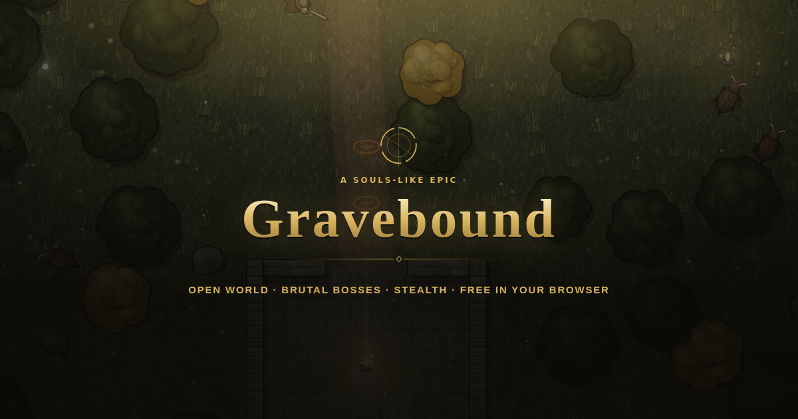
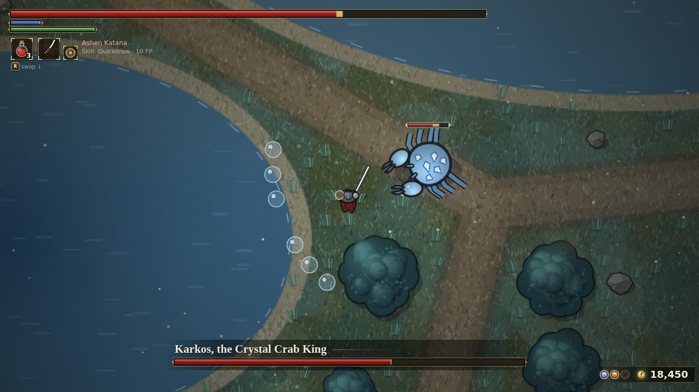
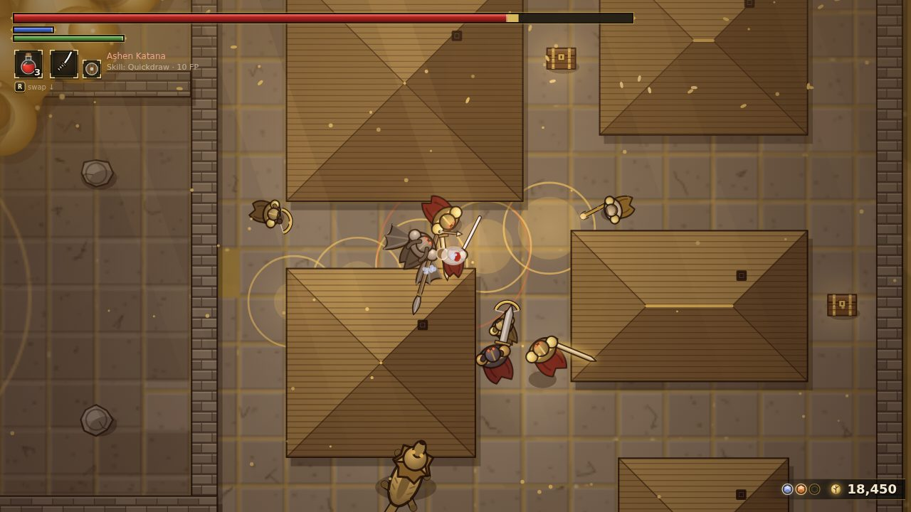
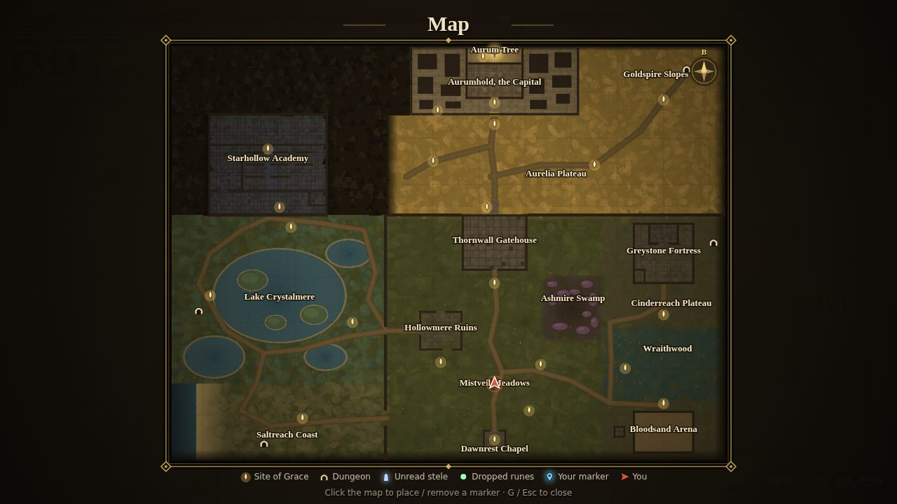
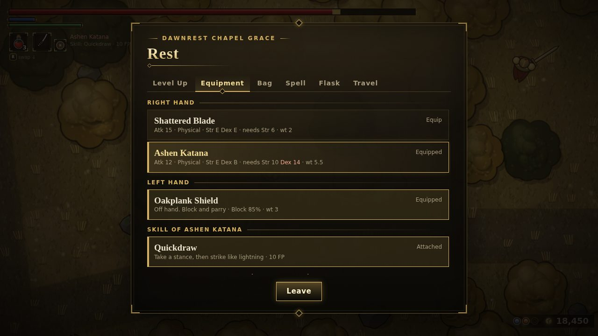

# Gravebound

*A 2D souls-like epic you can play right in your browser.*
*Một trường ca souls-like 2D, chơi ngay trên trình duyệt.*

**▶ Play now / Chơi ngay:** https://quanggquangg.github.io/Gravebound/

[English](#english) · [Tiếng Việt](#tiếng-việt)

> A fan-made game inspired by Elden Ring. / Game do người hâm mộ tự làm, lấy cảm hứng từ Elden Ring.

---

## English

Plays on desktop, phone and controller, with no download. English by default; switch to Vietnamese from the top of the title screen or in the pause menu. You can also **install it as an app** (Add to Home Screen) to play fullscreen and offline.

### The legend

**The Golden Age.** When the world was young, the Aurum Tree rose at the far edge of the north. Its roots held the **Aurum Ring**, the golden ring that kept order between life and death. Beneath its golden canopy, King **Aurel** raised the Capital of **Aurumhold**. For a thousand years the dead returned to the roots, and golden light shone across the land.

**The Night the Ring Broke.** Then, on a moonless night, the Aurum Ring shattered. No one knows whose hand broke it. Its greatest shards, the **Great Runes**, fell to the mightiest in the land. The golden leaves turned to ash. The dead lost their way home: bound to their graves, one day they crawl back up from the cold earth. The common folk call them the **Gravebound**.

**The Rune Bearers.**
- **Dornach**, the king's most loyal guard, sealed himself in Greystone Fortress.
- The ancient dragon **Ignarth** sleeps in the heart of Ashmire Swamp with a shard in its belly.
- Queen **Selvara** of Starhollow Academy pulls the stars down to read the future.

And **Varek**, the masked gatekeeper, swore that no Gravebound would ever touch the Tree.

**You.** You are Gravebound too, but Grace woke you in Dawnrest Chapel, with no weapon and no name. Will you mend the Ring, or claim it for yourself?

### Highlights

- **An open world with no hand-holding.** Nearly 20 regions: meadows, poison swamps, a crystal lake, a haunted wood, golden plateaus, a capital. Each has its own light, weather, music and creatures. The story unfolds through dialogue and messages left on the ground.
- **Souls-like combat.**
  - Rolls with invincibility frames, blocking and parrying.
  - Ripostes, backstabs and guard counters.
  - Stamina management, lock-on and mounted combat.
- **Enemies that think.** Foes see ahead of them and hear your noise, grow suspicious before they attack, call nearby packmates, and take turns attacking instead of mobbing you. Sneak up and stab them in the back, and never drink a flask in front of them.
- **Build your character.** 5 origins, 7 stats, swords, katanas, spears, axes, greatswords, hammers, scythes and bows, sorceries and incantations, armor, over 30 talismans and weapon upgrades.
- **Every creature drops something of its own.** Each enemy type has a rare drop: a talisman with a unique effect, a weapon, a shield or armor.
- **Bosses.** Varek, the dragon Ignarth, Dornach, Selvara, the Wraith Queen Seluna, Karkos the Crystal Crab King, Veyl the Drowned Admiral, Aurion the Goldhorn Patriarch, the Hidden King, and the final battle in the Aurum Realm.
- **Side content.** 4 dungeons with puzzles and traps, the Bloodsand Arena, illusory walls, and Hearthhold Hall with a smith, a merchant, a scholar and a sister of faith.
- **A map that fills in as you go.** Read the glowing blue Map Steles to sketch each region, place markers, and fast travel between Sites of Grace.
- **4 difficulties.** Easy and Normal are open from the start. **Hard** and **Expert** unlock after your first clear:
  - Elite enemies with strange traits.
  - Red Gravebound who invade your world.
  - Bosses that call for help.
  - Messages from yourself on a previous run.
- **26 achievements**, a **shared leaderboard** per difficulty, and **3 save slots**.
- **Bestiary:** every species you defeat gets a page with a portrait, where it lives, weaknesses, rare drops and a tip. The death screen tells you what killed you and how to beat it next time.
- **Settings:** music and effects volume, screen shake, text size, and fully rebindable keys (on-screen hints follow your keys).
- **Runs smoothly on phones:** on high-density screens the game lowers its render resolution on its own when the frame rate drops.

### How to play

| Action | Keyboard / mouse | Controller |
|---|---|---|
| Move | `W` `A` `S` `D` | left stick |
| Roll / sprint | tap / hold `Space` | tap / hold B / ○ |
| Light / heavy attack | left click / `Shift` + left click | R1 / R2 |
| Guard, cast | hold right click | L1 |
| Weapon skill | `Shift` + right click | L2 |
| Drink flask / use item | `R` (switch with `↓`) | □ / X |
| Interact | `E` | △ / Y |
| Lock on | `Q` | R3 |
| Switch weapon / spell | `←` `→` / `↑` | D-pad |
| Summon horse | `F` | × / A |
| Map / inventory | `G` / `I` | Share / Back |
| Pause | `Esc` | Start |

Every key can be changed in **Settings**. On phones, a virtual stick and buttons appear automatically.

**Goal:** wake in Dawnrest Chapel and head north. Let the land tell you the rest.

#### Combat

- **Roll:** you roll the way you are moving. The afterimage behind you is your invincibility window. Roll while standing still to backstep.
- **Parry:** raise your shield just as the blow lands, and the enemy loses their footing.
- **Riposte:** press light attack on an enemy who has lost their footing for a critical hit.
- **Backstab:** walk up behind an enemy that is not attacking and press light attack. Walking is quiet; sprinting, rolling, swinging and riding are loud.
- **Guard counter:** press heavy attack right after blocking a hit.
- **Read the eye:** an eye above an enemy's head means it is getting suspicious. Once a **!** appears, it has spotted you.

### Survival tips

- **Sites of Grace** heal you, refill your flasks, let you level up and bring you back after death. But every time you rest, the enemies return too.
- **Dying drops your runes** where you fell. Touch the green glow to reclaim them; die again before you do and they are gone for good.
- **Don't roll too early.** Many enemies hold their blade a beat longer on purpose.
- **Keep some stamina.** With none left you can neither roll nor attack.
- **Read the messages on the ground** (orange rings). They hint at how to beat bosses and solve puzzles.
- **Anything that glints can be used with `E`.** And try swinging at walls that sound hollow.

### Challenges

- 🏆 **Leaderboard:** fewest deaths ranks first; ties go to the fastest clear.
- ☠️ **Never Laid to Rest:** finish without dying once.
- ⏱️ **Hasty Wanderer:** finish in under 2 hours.
- 🔥 **The Expert cycle:** nearly half of all enemies are elites, and three Red Gravebound (Morrow, Isolde, Brannoc) hunt you. Defeat them for talismans found nowhere else.

---

## Tiếng Việt

Chơi được trên máy tính, điện thoại và tay cầm, không cần cài đặt. Game mặc định là tiếng Anh; chuyển sang tiếng Việt ở góc trên màn hình chính hoặc trong menu tạm dừng. Bạn cũng có thể **cài game như một ứng dụng** (Thêm vào Màn hình chính) để chơi toàn màn hình và chơi cả khi không có mạng.

### Truyền thuyết

**Thuở Ánh Vàng.** Khi thế giới còn non, Cây Aurum mọc lên ở tận cùng phương bắc. Rễ cây ôm lấy **Vòng Aurum**, chiếc vòng vàng giữ trật tự giữa sự sống và cái chết. Dưới tán lá vàng, vua **Aurel** dựng nên Kinh Thành **Aurumhold**. Suốt một ngàn năm, người chết đều trở về với rễ cây, và ánh vàng soi khắp vùng đất.

**Đêm Vỡ Vòng.** Rồi một đêm không trăng, Vòng Aurum vỡ tan. Không ai biết bàn tay nào đã đập vỡ nó. Những mảnh lớn nhất, gọi là **Đại Ấn**, rơi vào tay những kẻ mạnh nhất vùng đất. Lá vàng rụng thành tro. Người chết không còn đường về: họ bị trói lại nơi nấm mồ, rồi một ngày lại bò lên từ đất lạnh. Dân gian gọi họ là **Gravebound**.

**Những Kẻ Giữ Ấn.**
- **Dornach**, vệ binh trung thành nhất của nhà vua, khóa mình trong Pháo Đài Greystone.
- Rồng cổ **Ignarth** ngủ giữa Đầm Lầy Ashmire với mảnh ấn trong bụng.
- Nữ hoàng **Selvara** của Học Viện Starhollow kéo các vì sao xuống trần để đọc tương lai.

Và **Varek**, kẻ gác cổng đeo mặt nạ, đã thề không một Gravebound nào được chạm vào Cây.

**Ngươi.** Ngươi cũng là một Gravebound, nhưng được Ân Điển đánh thức tại Nhà Nguyện Dawnrest, không vũ khí, không danh phận. Ngươi sẽ hàn gắn Vòng, hay tự mình đội lấy nó?

### Điểm nổi bật

- **Thế giới mở, không dẫn đường sẵn.** Gần 20 vùng đất: đồng cỏ, đầm lầy độc, hồ pha lê, rừng hồn ma, cao nguyên vàng, kinh thành. Mỗi vùng có ánh sáng, thời tiết, nhạc nền và sinh vật riêng. Cốt truyện được kể dần qua lời thoại và lời nhắn trên mặt đất.
- **Chiến đấu kiểu souls.**
  - Lăn né có khung bất tử, đỡ và phản đòn.
  - Kết liễu, đâm lưng, phản công sau khi đỡ.
  - Quản lý thể lực, khóa mục tiêu, cưỡi ngựa.
- **Kẻ địch biết suy nghĩ.** Quái nhìn về phía trước và nghe tiếng động của ngươi, nghi ngờ dần trước khi tấn công, gọi đồng bọn gần đó, và thay phiên ra đòn thay vì cùng lao vào. Hãy lén ra sau lưng mà đâm, và đừng uống bình ngay trước mặt chúng.
- **Tự xây nhân vật.** 5 xuất thân, 7 chỉ số, kiếm, katana, giáo, rìu, đại kiếm, búa, lưỡi hái, cung, phép Trí Tuệ và Đức Tin, giáp, hơn 30 loại bùa hộ mệnh và cường hóa vũ khí.
- **Mỗi loại quái rơi đồ riêng.** Mỗi loại kẻ địch có một món đồ hiếm của riêng nó: bùa có hiệu ứng riêng, vũ khí, khiên hoặc giáp.
- **Boss.** Varek, rồng Ignarth, Dornach, Selvara, Nữ Vương Hồn Ma Seluna, Vua Cua Pha Lê Karkos, Đô Đốc Chết Đuối Veyl, Dê Chúa Sừng Vàng Aurion, Vua Ẩn Mặt và trận cuối trong Cõi Aurum.
- **Nội dung phụ.** 4 hầm ngục có câu đố và bẫy, Đấu Trường Bloodsand, tường ảo giấu bí mật, và Sảnh Hearthhold có thợ rèn, lái buôn, học giả, nữ tu.
- **Bản đồ mở dần.** Tìm Bia Bản Đồ phát sáng xanh để vẽ từng vùng. Đặt dấu trên bản đồ, dịch chuyển nhanh giữa các Ân Điển.
- **4 độ khó.** Dễ và Thường chọn được ngay. **Khó** và **Chuyên gia** mở sau lần phá đảo đầu tiên, gồm:
  - Quái tinh anh mang thuộc tính.
  - Gravebound Đỏ xâm nhập thế giới của ngươi.
  - Boss gọi thêm tay sai.
  - Lời nhắn từ chính ngươi ở lần chơi trước.
- **26 thành tựu**, **bảng xếp hạng chung** chia theo độ khó và **3 ô lưu**.
- **Sổ tay quái vật:** mỗi loài đã hạ có một trang riêng với chân dung, nơi sống, điểm yếu, đồ hiếm và mẹo đánh. Màn hình chết cho biết ai đã hạ ngươi và cách thắng lần sau.
- **Cài đặt:** âm lượng nhạc và hiệu ứng, rung màn hình, cỡ chữ, đổi được mọi phím bấm (chữ hướng dẫn hiện đúng phím đã gán).
- **Mượt trên điện thoại:** trên màn hình mật độ cao, game tự hạ độ phân giải khi khung hình tụt.

### Cách chơi

| Hành động | Bàn phím / chuột | Tay cầm |
|---|---|---|
| Di chuyển | `W` `A` `S` `D` | cần trái |
| Lăn né / chạy nhanh | nhấn / giữ `Space` | nhấn / giữ B / ○ |
| Đánh thường / đánh mạnh | chuột trái / `Shift` + chuột trái | R1 / R2 |
| Đỡ đòn, niệm phép | giữ chuột phải | L1 |
| Kỹ năng vũ khí | `Shift` + chuột phải | L2 |
| Uống bình / dùng đồ | `R` (đổi đồ `↓`) | □ / X |
| Tương tác | `E` | △ / Y |
| Khóa mục tiêu | `Q` | R3 |
| Đổi vũ khí / đổi phép | `←` `→` / `↑` | D-pad |
| Gọi ngựa | `F` | × / A |
| Bản đồ / hành trang | `G` / `I` | Share / Back |
| Tạm dừng | `Esc` | Start |

Mọi phím đều đổi được trong **Cài đặt**. Trên điện thoại, cần điều khiển và các nút bấm tự hiện ra.

**Mục tiêu:** tỉnh dậy ở Nhà Nguyện Dawnrest và đi về phương bắc. Phần còn lại, hãy để vùng đất tự kể cho ngươi.

#### Chiến đấu

- **Lăn:** lăn theo hướng đang di chuyển. Bóng mờ phía sau nhân vật là lúc bất tử. Đứng yên mà bấm lăn thì nhảy lùi.
- **Phản đòn:** giơ khiên đúng lúc đòn chạm tới, kẻ địch sẽ mất thế.
- **Kết liễu:** bấm đánh thường trước kẻ địch đang mất thế để ra đòn chí mạng.
- **Đâm lưng:** đi bộ tới sau lưng kẻ địch chưa ra đòn rồi bấm đánh thường. Đi bộ rất êm; chạy nhanh, lăn, vung vũ khí hay cưỡi ngựa thì gây tiếng động.
- **Phản công:** vừa đỡ trúng một đòn thì bấm đánh mạnh ngay.
- **Nhìn con mắt:** con mắt trên đầu quái nghĩa là nó đang nghi ngờ. Khi hiện dấu **!** là nó đã phát hiện ra ngươi.

### Mẹo sống sót

- **Ân Điển** là nơi hồi máu, nạp bình, lên cấp và hồi sinh. Nhưng mỗi lần nghỉ, quái cũng sống lại.
- **Chết là rơi rune** tại chỗ. Quay lại chạm đốm sáng xanh để lấy lại; chết lần nữa trước khi tới được đó là mất hẳn.
- **Đừng lăn vội.** Nhiều kẻ địch cố tình giữ lưỡi kiếm lâu hơn một nhịp.
- **Luôn chừa thể lực.** Hết thể lực thì không lăn, không đánh được.
- **Đọc lời nhắn trên mặt đất** (vòng lửa cam). Chúng gợi ý cách hạ boss và lời giải câu đố.
- **Mọi thứ có dấu sáng đều nhấn `E` được.** Và hãy thử vung kiếm vào những bức tường nghe rỗng.

### Thử thách

- 🏆 **Bảng xếp hạng:** ai chết ít nhất đứng đầu; bằng nhau thì ai phá đảo nhanh hơn thắng.
- ☠️ **Chưa Từng Nằm Xuống:** phá đảo mà không chết lần nào.
- ⏱️ **Kẻ Lữ Hành Vội Vã:** phá đảo dưới 2 giờ.
- 🔥 **Chu kỳ Chuyên gia:** gần nửa số quái là tinh anh, và ba Gravebound Đỏ (Morrow, Isolde, Brannoc) săn đuổi ngươi. Hạ được chúng sẽ nhận những bùa chỉ có ở chu kỳ này.

